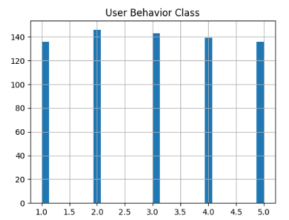
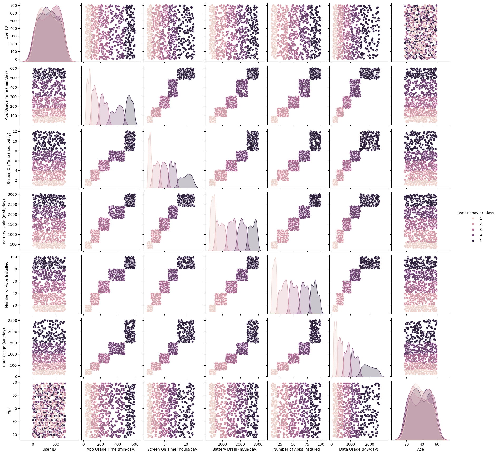
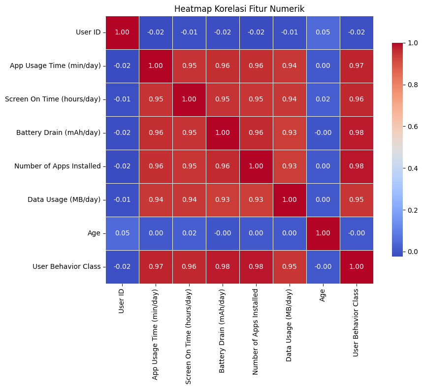

# Laporan Proyek Machine Learning - Muhammad Fathi Radithya

## Domain Proyek

### Latar Belakang
Penggunaan perangkat mobile telah menjadi bagian integral dari kehidupan sehari-hari. Dengan meningkatnya ketergantungan tersebut, penting bagi pengembang dan penyedia layanan untuk memahami perilaku pengguna guna meningkatkan pengalaman pengguna dan efisiensi aplikasi. Masalah ini dapat diselesaikan dengan membangun model machine learning yang dapat mengklasifikasikan perilaku pengguna berdasarkan data penggunaan perangkat.
    
##  Business Understanding

### Problem Statements: 
Bagaimana memprediksi klasifikasi perilaku pengguna perangkat mobile (dari ringan hingga ekstrem) berdasarkan data penggunaan perangkat seperti waktu penggunaan aplikasi, waktu layar aktif, konsumsi baterai, dan lainnya?

### Goals: 
- Membangun model klasifikasi machine learning yang dapat mengkategorikan perilaku pengguna ke dalam lima kelas berdasarkan data penggunaan perangkat.
- Membandingkan performa evaluasi model untuk menentukan solusi yang lebih optimal. 

### Solution Statement:  
- Membuat model klasifikasi menggunakan K-Nearest Neighbor (KNN) dan Random Forest (RF)
- Menggunakan metrik accuracy, f1-score, dan confusion matrix.
      
## Data Understanding

### Sumber Dataset
[Mobile Device Usage and User Behavior Dataset](https://www.kaggle.com/datasets/valakhorasani/mobile-device-usage-and-user-behavior-dataset)

### Deskripsi Dataset
Dataset berisi 700 baris data dan 11 kolom fitur yang mencerminkan perilaku penggunaan perangkat mobile:

-   User ID: ID unik pengguna (tidak dipakai dalam modeling)  
-   Device Model: Tipe perangkat  
-   Operating System: Android/iOS  
-   App Usage Time (min/day): Durasi harian menggunakan aplikasi  
-   Screen On Time (hours/day): Durasi layar menyala  
-   Battery Drain (mAh/day): Konsumsi baterai harian  
-   Number of Apps Installed: Jumlah aplikasi terinstal  
-   Data Usage (MB/day): Konsumsi data harian  
-   Age: Usia pengguna  
-   Gender: Jenis kelamin  
-   User Behavior Class: Label kelas target perilaku 

### Tahapan Lanjutan:
- Pemeriksaan struktur data (jumlah data, tipe variabel). 
```
df.info()
df.describe()
```
- Penanganan Missing Value
```
print("Jumlah Missing Values per Kolom:")
missing_counts = df.isnull().sum()
print(missing_counts)
```
Data yang mengandung nilai kosong (missing values) dapat mengganggu proses analisis dan pelatihan model machine learning. Oleh karena itu, perlu dilakukan identifikasi terhadap kolom-kolom yang memiliki nilai kosong.
* df.isnull(): Mengembalikan DataFrame boolean dengan nilai True pada sel yang kosong (missing) dan False untuk sel yang tidak kosong.
* sum(): Menghitung jumlah True pada setiap kolom, sehingga diperoleh total nilai kosong per kolom.

- Penanganan Duplicate Value
```
# 1. Cek jumlah baris duplikat
duplicate_rows = df.duplicated()
total_duplicates = duplicate_rows.sum()
print(f"Jumlah baris duplikat: {total_duplicates}")

# 2. Tampilkan contoh duplikat (jika ada)
if total_duplicates > 0:
print("\nContoh baris duplikat:")
print(df[duplicate_rows].head())
```
Data duplikat adalah baris data yang identik secara keseluruhan dengan baris lain.
* df.duplicated(): Mengembalikan Series boolean yang bernilai True untuk setiap baris yang merupakan duplikat dari baris sebelumnya, dan False jika tidak.
*   sum(): Menjumlahkan seluruh nilai True (baris duplikat) untuk mengetahui total jumlah data yang duplikat.
*   df[duplicate_rows].head(): Menampilkan contoh baris data yang terdeteksi sebagai duplikat (jika ada) agar bisa diperiksa secara manual.

- Menangani Outliers
```
# 1. Ambil kolom numerik
num_cols = df.select_dtypes(include='number').columns

# 2. Buat boxplot untuk tiap kolom numerik
plt.figure(figsize=(6,  len(num_cols) * 3))
for i, col in  enumerate(num_cols,  1):
plt.subplot(len(num_cols),  1, i)
sns.boxplot(x=df[col], color='skyblue')
plt.tight_layout()

plt.show()
```
Boxplot digunakan untuk visualisasi, menunjukkan distribusi data berdasarkan lima nilai ringkasan: minimum, Q1 (kuartil pertama), median, Q3 (kuartil ketiga), dan maksimum.
```
# 3. Hitung Q1, Q3, dan IQR hanya untuk kolom numerikal
Q1 = df[numeric_cols].quantile(0.25)
Q3 = df[numeric_cols].quantile(0.75)
IQR = Q3 - Q1

# 4. Buat filter untuk menghapus baris yang mengandung outlier di kolom numerikal
filter_outliers = ~((df[numeric_cols] < (Q1 - 1.5 * IQR)) |
(df[numeric_cols] > (Q3 + 1.5 * IQR))).any(axis=1)

# 5. Terapkan filter ke dataset asli (termasuk kolom non-numerikal)
df = df[filter_outliers]
```
Metode IQR digunakan untuk mendeteksi dan menghapus outlier dari fitur numerikal.
* Mendefinisikan Q1 dan Q3 menggunakan quantile(), dan kemudian menetapkan IQR dengan menguringi nilai Q3 dan Q1.
* Nilai outlier ditentukan jika dibawah batas minimum, Q1 - 1.5 × IQR, atau melebihi batas maksimum Q3 + 1.5 × IQR.
```
# 6. Cek ukuran dataset setelah outlier dihapus
df.shape

(700, 11)
```
Berdasarkan plot, tidak ada titik data yang keluar dari batas minimum dan maksimum, hasil shape masih menampilkan 700 baris, menandakan tidak ada data outlier.
- EDA
     - Univariate
 Plot distribusi class 'User Behavior Class' dalam dataset. Terlihat bahwa distribusi kurang lebih rata untuk tiap kategori, menunjukkan bahwa dataset seimbang.
     - Multivariate

	Pairplot digunakan untuk melihat keseluruhan hubungan antara semua fitur numerik dalam dataset. Dari plot dapat mengambil hubungan numerik yang kuat. Sebagai contoh, semakin tinggi 'App Usage Time (min/day)' dan 'Screen On Time (hours/day)' cenderung terdapat pada User Behavior Class yang tinggi juga.
     - Heatmap

	Digunakan untuk mengukur korelasi antara dua variabel numerik, dengan nilai berkisar dari:
	`+1.0` → korelasi positif sempurna
	`0.0` → tidak ada korelasi
	`–1.0` → korelasi negatif sempurna
	Hampir semua fitur numerik memiliki korelasi tinggi >0.9, kecuali User ID dan Age, menandakan kedua variable tidak memiliki kontribusi prediktif yang dalam dataset.


## Data Preparation
Tahapan yang dilakukan:
1.  Menghapus kolom tidak relevan (User ID).
2.  Encoding: Menggunakan One-Hot Encoding untuk fitur kategorikal `Device Model`, `Operating System`, dan `Gender`.
3.  Train-Test-Split: Pembagian data untuk set training dan set test (80% train, 20% test).
4.  Standarisasi: Menggunakan StandarScaler untuk standarisasi fitur numerik.  
      
## Modeling
Model yang digunakan:
-   K-Nearest Neighbors (KNN) :
	- Bekerja dengan mencari _K_ data latih terdekat (tetangga) dari suatu data uji, lalu memprediksi label berdasarkan mayoritas kelas dari tetangga tersebut.
	- Parameter: Default (`n_neighbors=5`, `weights='uniform'`, `algorithm='auto'`, dan `metric='minkowski'`, `p=2`)
-   Random Forest (RF) :
	- Algoritma berbasis ensamble yang membentuk banyak _decision tree_ secara acak, lalu menggabungkan prediksinya melalui voting mayoritas untuk meningkatkan akurasi dan mengurangi overfitting.
	- Parameter: Default (`n_estimators=100`, dan `max_depth=None`, `random_state=42`).

## Evaluasi Model
Metrik yang digunakan:
- Accuracy: Mengukur proporsi prediksi yang benar dari seluruh data.  
- F1-Score: Merupakan harmonisasi antara precision dan recall. Nilai dihitung menggunakan rata-rata tertimbang berdasarkan jumlah sampel pada setiap kelas.
- Confusion Matrix: Menunjukkan rincian prediksi benar dan salah untuk masing-masing kelas.

Rumus dari metrik:
- `Accuracy = (True Positive + True Negative) / (True Positive + True Negative + False Positive +  False Negative)`
- `Precision = True Positive / (True Positive + False Positive)`
- `Recall = True Positive / (True Positive + False Negative)`
- `F1-Score = 2 x Precision x Recall / (Precision + Recall) `

Evaluasi Accuracy dan F1-Score:
| Model                     | Train Accuracy  | Train F1-Score | Test Accuracy | Test F1-Score |
|---------------------------|-----------------|----------------|---------------|---------------|
| K-Nearest Neighbors (KNN) |     94.64%      |     94.65%     |     87.86%    |     87.67%    |
| Random Forest (RF)        |    100.00%      |    100.00%     |    100.00%    |    100.00%    |

Evaluasi Confusion Matrix:
